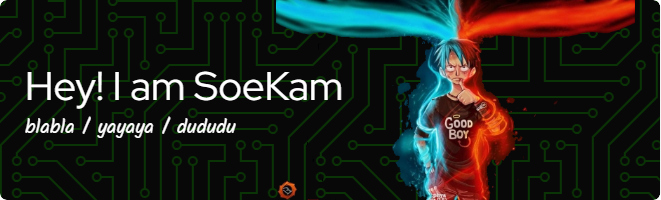

<!--
  https://docs.github.com/en/get-started/writing-on-github/getting-started-with-writing-and-formatting-on-github/basic-writing-and-formatting-syntax
-->

# Hello Guys 👋
<!--leviarista-->

- I just tried GitHub 😁

#### Skill
<!--
    ada tulisan = alexandresanlim
-->
<!--    -->

<!--
    icon = tandpfun
-->
<!--  -->

###

  
  
  
  
  

###

  
  
  
  

###

 

<h4 align="left">My github Stats</h4>
<picture>
  <source
    srcset="https://github-readme-stats.vercel.app/api?username=soekam28&show_icons=true&theme=shadow_green"
    media="(prefers-color-scheme: dark)"
  />
  <source
    srcset="https://github-readme-stats.vercel.app/api?username=soekam28&show_icons=true&theme=buefy"
    media="(prefers-color-scheme: light), (prefers-color-scheme: no-preference)"
  />
  
</picture>

<!--
  lebih mudah
  https://gprm.itsvg.in/
  https://profile-readme-generator.com/
-->

 

<h4 align="left">Playing Game</h4>

###

 

<picture>
  <source media="(prefers-color-scheme: dark)" srcset="https://raw.githubusercontent.com/soekam28/soekam28/output/pacman-contribution-graph-dark.svg">
  <source media="(prefers-color-scheme: light)" srcset="https://raw.githubusercontent.com/soekam28/soekam28/output/pacman-contribution-graph.svg">
  
</picture>

###